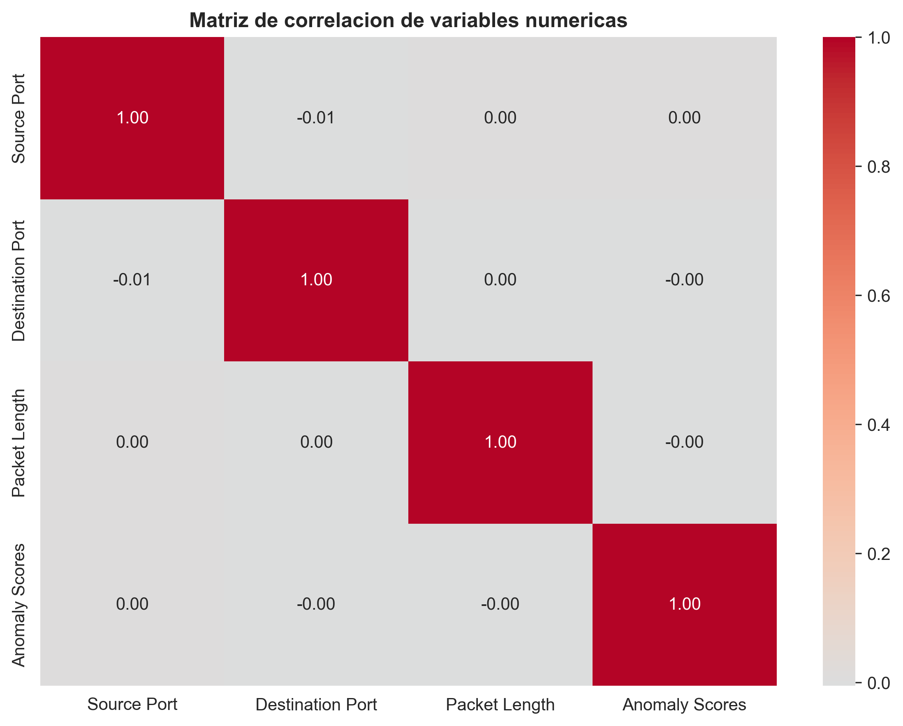
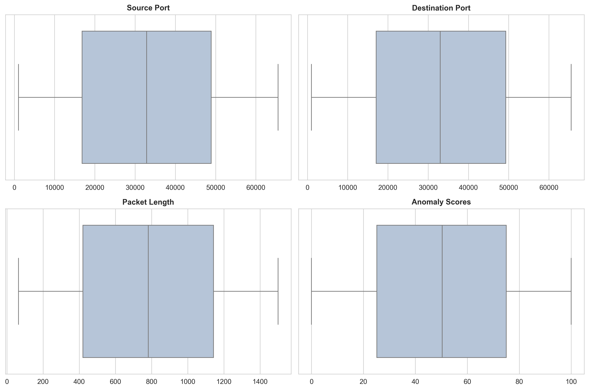
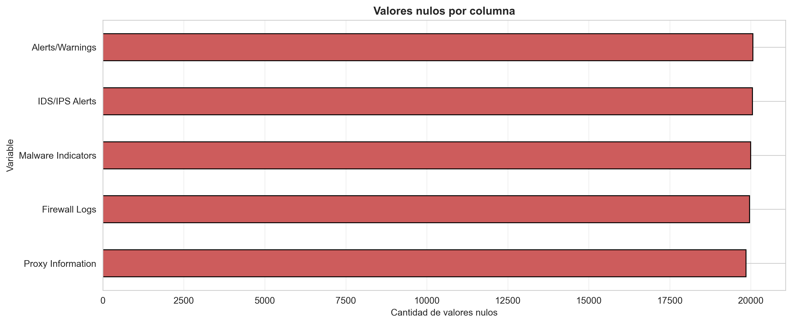
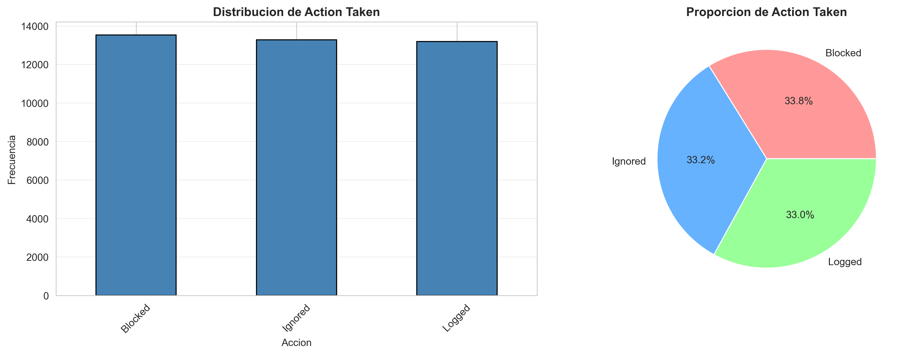
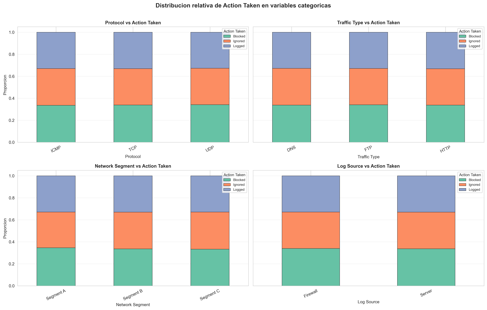
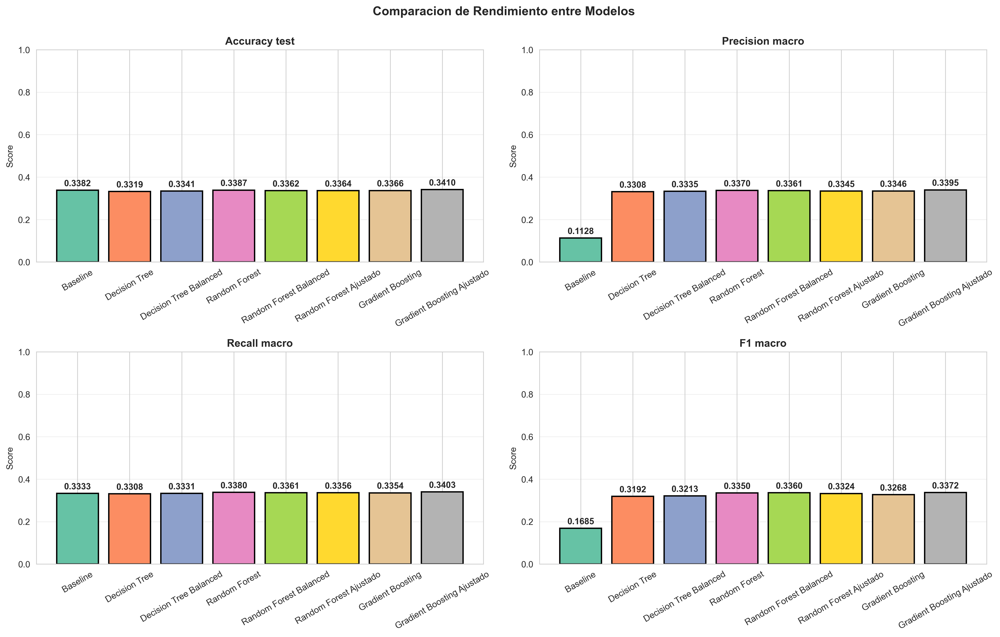
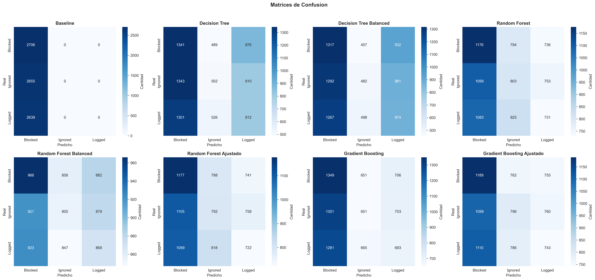
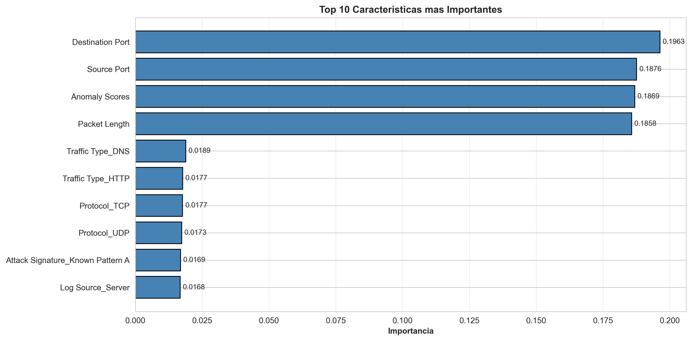

# Práctica de Machine Learning - Clasificación de Ataques Cibernéticos


[🇬🇧 English version](README.en.md)

*Proyecto de clasificación multiclase en Python para predecir la acción tomada ante ataques cibernéticos a partir del dataset `cybersecurity_attacks.csv`, con enfoque académico y presentación orientada a portfolio.*

---

## 1️⃣ Resumen del proyecto


Esta práctica desarrolla un problema de clasificación multiclase sobre el dataset `cybersecurity_attacks.csv` con el objetivo de predecir la variable objetivo principal `Action Taken`. El trabajo sigue un flujo completo de análisis exploratorio, selección de variables, preprocesamiento, entrenamiento de varios modelos, evaluación y conclusión interpretada. Además, se incorporan los targets `Severity Level` y `Attack Type` como ampliación comparativa opcional, sin desplazar el foco principal del proyecto.

### Resultados clave


- **Target principal:** `Action Taken`
- **Mejor modelo:** `Gradient Boosting Ajustado`
- **Accuracy:** `0.3410`
- **F1 macro:** `0.3372`
- **Registros del dataset:** `40.000`
- **Variables:** `25`

---

## 2️⃣ Objetivos


- Analizar la estructura y calidad del dataset.
- Preparar los datos para el modelado tabular.
- Entrenar varios modelos de clasificación.
- Comparar el rendimiento entre enfoques distintos.
- Interpretar los resultados con criterio metodológico.
- Ampliar el análisis con targets adicionales comparables.

---

## 3️⃣ Dataset


El dataset utilizado contiene **40.000 registros** y **25 variables**. Se trata de un problema de **clasificación multiclase** en el que la variable objetivo principal obligatoria es `Action Taken`.

Targets trabajadas en el proyecto:

- **Target principal:** `Action Taken`
- **Targets adicionales opcionales:** `Severity Level`, `Attack Type`

---

## 4️⃣ Stack tecnológico


Tecnologías y librerías utilizadas:

- `Python`
- `pandas`
- `numpy`
- `matplotlib`
- `seaborn`
- `scikit-learn`

---

## 5️⃣ Flujo de trabajo / Metodología


El proyecto sigue un pipeline completo y coherente de clasificación:

```text
EDA -> seleccion de variables -> preprocesamiento -> train/test split
-> entrenamiento -> evaluacion -> interpretacion -> experimentos adicionales
```

Fases principales del trabajo:

1. Análisis exploratorio del dataset.
2. Revisión y selección de variables útiles para modelado tabular.
3. Construcción del preprocesamiento para variables numéricas y categóricas.
4. División estratificada en entrenamiento y prueba.
5. Entrenamiento de varios modelos base y variantes ajustadas.
6. Evaluación con métricas de clasificación y validación cruzada.
7. Interpretación de resultados y lectura metodológica final.
8. Ampliación comparativa con `Severity Level` y `Attack Type`.

---

## 6️⃣ Análisis exploratorio de datos


En la fase de análisis exploratorio se revisaron:

- forma del dataset (`shape`)
- primeras filas (`head`)
- estructura general (`info`)
- tipos de datos
- estadísticas descriptivas (`describe`)
- correlaciones entre variables numéricas
- detección simple de outliers
- valores nulos por columna
- cardinalidad de variables categóricas
- distribución de la target principal
- relación entre variables categóricas seleccionadas y `Action Taken`

Este análisis permitió detectar una señal predictiva limitada pero existente, así como justificar una selección prudente de variables antes del modelado.

### Evidencias visuales del EDA



*Matriz de correlación entre variables numéricas.*



*Detección visual de valores extremos mediante boxplots.*



*Distribución de valores nulos por variable.*



*Distribución de `Action Taken` en frecuencia y proporción.*



*Relación relativa entre variables categóricas seleccionadas y la target principal.*

---

## 7️⃣ Preprocesamiento


El preprocesamiento se diseñó para mantener un enfoque claro y adecuado para modelado tabular, evitando complejidad innecesaria y preservando la trazabilidad metodológica.

### Variables eliminadas antes del modelado

Se descartaron las siguientes columnas por no ser adecuadas para este enfoque tabular, por actuar como identificadores, por contener texto libre o por su dificultad para aportar valor directo sin un procesamiento adicional:

- `Timestamp`
- `Source IP Address`
- `Destination IP Address`
- `Payload Data`
- `User Information`
- `Device Information`
- `Geo-location Data`
- `Firewall Logs`
- `IDS/IPS Alerts`
- `Proxy Information`

### Revisión de variables categóricas

Tras revisar las variables candidatas, se descartaron por baja capacidad informativa o comportamiento casi constante:

- `Malware Indicators`
- `Alerts/Warnings`

### Variables finales utilizadas

- `Source Port`
- `Destination Port`
- `Protocol`
- `Packet Length`
- `Packet Type`
- `Traffic Type`
- `Anomaly Scores`
- `Attack Signature`
- `Network Segment`
- `Log Source`

### Transformaciones aplicadas

- Separación entre variables numéricas y categóricas.
- Imputación de nulos con **mediana** en variables numéricas.
- Imputación de nulos con **moda** en variables categóricas.
- Codificación **One-Hot Encoding** para variables categóricas.
- División **train/test con estratificación** para preservar la distribución de clases.

---

## 8️⃣ Modelos entrenados


Modelos comparados en la práctica:

- `Baseline (DummyClassifier)`
- `Decision Tree`
- `Decision Tree Balanced`
- `Random Forest`
- `Random Forest Balanced`
- `Random Forest Ajustado`
- `Gradient Boosting`
- `Gradient Boosting Ajustado`

El enfoque combina un **baseline sencillo** con modelos de árbol y boosting. También se probaron:

- variantes con `class_weight='balanced'`
- búsquedas acotadas de hiperparámetros para `Random Forest` y `Gradient Boosting`

Esto permite comparar modelos simples, versiones balanceadas y alternativas ajustadas dentro de una práctica académica realista.

---

## 9️⃣ Resultados principales


### Resultado para la target principal `Action Taken`

> **Mejor modelo en test:** `Gradient Boosting Ajustado`  
> **Accuracy:** `0.3410`  
> **Precision macro:** `0.3395`  
> **Recall macro:** `0.3403`  
> **F1 macro:** `0.3372`

El mejor rendimiento en test dentro de esta comparación se obtuvo con **Gradient Boosting Ajustado**, aunque la lectura del proyecto debe hacerse desde una perspectiva prudente: las métricas muestran cierta capacidad predictiva, pero no una separación fuerte entre clases.

### Evidencias visuales de evaluación



*Comparación de métricas entre los modelos entrenados.*



*Matrices de confusión para los modelos evaluados.*

---

## 🔟 Interpretación de resultados


La lectura global de resultados apunta a un escenario metodológicamente correcto, pero con un rendimiento moderado. Esto es coherente con lo observado en el análisis exploratorio y con la naturaleza de las variables finalmente retenidas.

Puntos clave de interpretación:

- El problema contiene **cierta señal predictiva**, ya que los modelos mejoran respecto al baseline.
- El rendimiento sigue siendo **moderado**, lo que sugiere que la separación entre clases es solo parcial.
- El EDA ya mostraba **relaciones débiles o moderadas** entre varias variables categóricas y `Action Taken`.
- Parte de la información potencialmente útil quedó fuera por **alta cardinalidad**, **texto libre** o **baja capacidad informativa**.
- La práctica debe valorarse por la **coherencia del proceso**, la comparación entre modelos y la **calidad de la interpretación**, no solo por métricas elevadas.
- La importancia de variables extraída desde `Random Forest` debe entenderse como una **lectura complementaria** del comportamiento interno de ese modelo.
- Estas importancias **no implican causalidad** ni constituyen una jerarquía absoluta válida para cualquier algoritmo.

En conjunto, el resultado no debe presentarse como un caso de alto rendimiento predictivo, sino como una práctica sólida, bien ejecutada y bien interpretada.



*Importancia relativa de variables en la mejor variante de `Random Forest`.*

---

## 1️⃣1️⃣ Experimentos adicionales


Como ampliación comparativa opcional, también se evaluaron las targets `Severity Level` y `Attack Type` utilizando el mismo enfoque general de modelado.

### Resultados obtenidos

- **Severity Level**
  - Mejor modelo: `Random Forest`
  - Mejor F1 macro: `0.3349`

- **Attack Type**
  - Mejor modelo: `Random Forest`
  - Mejor F1 macro: `0.3373`

### Lectura de esta ampliación

- Las dos targets opcionales quedan **muy cerca** del rendimiento obtenido en `Action Taken`.
- Esto sugiere que, con las variables retenidas, la dificultad de los tres problemas es comparable.
- Estos experimentos se presentan como **ampliación comparativa**, no como eje central del proyecto.
- La **target principal sigue siendo `Action Taken`** y es la que estructura la práctica.

---

## 1️⃣2️⃣ Visualizaciones del proyecto


Gráficas generadas por el script y su utilidad:

- `00_matriz_correlacion.png`  
  Muestra la correlación entre variables numéricas.

- `00_boxplots_outliers.png`  
  Permite revisar visualmente posibles outliers.

- `00_valores_nulos.png`  
  Resume la presencia de valores nulos por columna.

- `01_distribucion_target.png`  
  Representa la distribución de la target principal.

- `01b_categoricas_vs_target.png`  
  Muestra la relación relativa entre variables categóricas seleccionadas y `Action Taken`.

- `02_comparacion_modelos.png`  
  Compara el rendimiento global entre modelos.

- `03_matrices_confusion.png`  
  Ayuda a entender errores y confusiones entre clases.

- `04_importancia_caracteristicas.png`  
  Ofrece una lectura complementaria sobre relevancia relativa de variables en `Random Forest`.

---

## 1️⃣3️⃣ Estructura del proyecto


```bash
.
├── cybersecurity_attacks.csv
├── main.py
├── README.md
├── README.en.md
├── 00_matriz_correlacion.png
├── 00_boxplots_outliers.png
├── 00_valores_nulos.png
├── 01_distribucion_target.png
├── 01b_categoricas_vs_target.png
├── 02_comparacion_modelos.png
├── 03_matrices_confusion.png
└── 04_importancia_caracteristicas.png
```

---

## 1️⃣4️⃣ Cómo ejecutar el proyecto


### 1. Clonar el repositorio

```bash
git clone https://github.com/David-Navarro-Oliver/practica-machine-learning.git
cd practica-machine-learning
```

### 2. Instalar dependencias

```bash
pip install pandas numpy matplotlib seaborn scikit-learn
```

### 3. Colocar el dataset en la raíz del proyecto

Asegúrate de que el archivo `cybersecurity_attacks.csv` esté en la carpeta principal del proyecto, junto a `main.py`.

### 4. Ejecutar el script

```bash
python main.py
```

Al ejecutar el script se generarán las gráficas y se mostrará por consola el análisis completo, el entrenamiento, la evaluación y la conclusión final.

---

## 1️⃣5️⃣ Conclusiones


Esta práctica desarrolla un flujo completo de clasificación en Python, incluyendo análisis exploratorio, selección razonada de variables, preprocesamiento, entrenamiento de modelos, evaluación y conclusión interpretada. Desde el punto de vista metodológico, el proyecto puede considerarse **sólido, coherente y defendible**.

La capacidad predictiva observada existe, pero es **limitada**. El rendimiento moderado resulta coherente con la señal disponible en el dataset y con el hecho de que las variables retenidas separan solo parcialmente las clases. En este contexto, el valor del trabajo está en la **comparación razonada de modelos**, en la **interpretación honesta de resultados** y en la **solidez del proceso completo**.

Como pieza de portfolio técnico, este proyecto refleja criterio en la preparación de datos, consistencia metodológica en la evaluación y una lectura final alineada con lo que realmente muestran los datos.

---

## 1️⃣6️⃣ Autor


**David Navarro**  
Proyecto académico realizado en KeepCoding para el módulo de IA y ciberseguridad.
